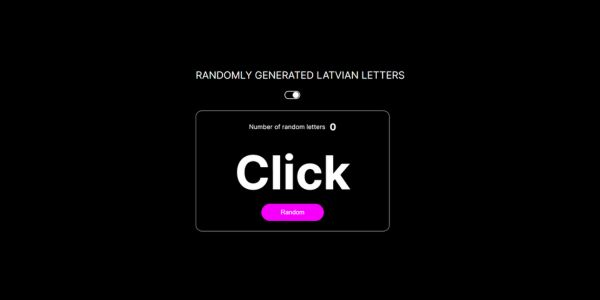
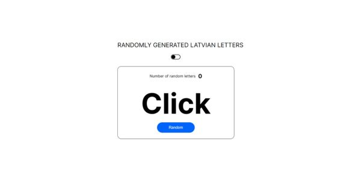

# Генератор случаемой латышской буквы

Данный проект создавался для изучения и запоминания Латышевских слов. А также небольшой интерактив для более интересного использования

__В даном проекте__
1. генерируется случайная буква
2. счетчик сколько раз была сгенерирована буква
3. возможность сменны цветовой темы
   
***

***

